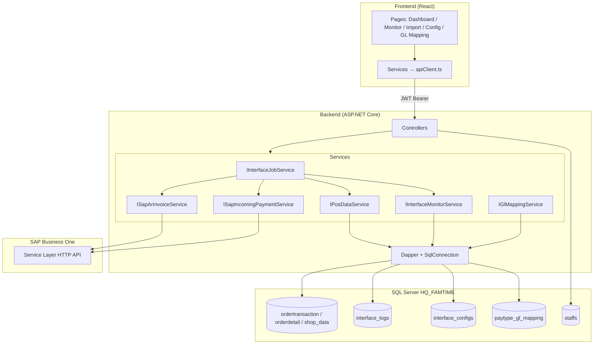

# POS2SAP — เอกสารโครงสร้างโปรเจกต์

> ระบบเชื่อมต่อ POS → SAP Business One  
> อ่านธุรกรรมจาก SQL Server (`HQ_FAMTIME`) แปลงเป็น AR Invoice / Incoming Payment แล้วส่งไป SAP ผ่าน HTTP  
> มี Web UI สำหรับ Monitor, Import, Config และ GL Mapping

---

## สารบัญ

1. [ภาพรวม](#1-ภาพรวม)
2. [โครงสร้างโฟลเดอร์](#2-โครงสร้างโฟลเดอร์)
3. [สถาปัตยกรรมระบบ](#3-สถาปัตยกรรมระบบ)
4. [Backend (.NET 8)](#4-backend-net-8)
5. [Frontend (React 19)](#5-frontend-react-19)
6. [ฐานข้อมูล](#6-ฐานข้อมูล)
7. [Flow การทำงานหลัก](#7-flow-การทำงานหลัก)
8. [API Endpoints](#8-api-endpoints)
9. [Scripts & เครื่องมือช่วยพัฒนา](#9-scripts--เครื่องมือช่วยพัฒนา)
10. [การ Build & Run](#10-การ-build--run)
11. [เอกสารที่เกี่ยวข้อง](#11-เอกสารที่เกี่ยวข้อง)

---

## 1. ภาพรวม

| ส่วน | เทคโนโลยี | Port (Dev) |
|------|-----------|------------|
| Backend API | ASP.NET Core 8, Dapper, Serilog, JWT, BCrypt, ULID | `5163` |
| Frontend UI | React 19, TypeScript, Vite, TanStack Query, Tailwind | `5173` |
| Database | SQL Server — `HQ_FAMTIME` (ใช้ร่วมกับ POS) | — |
| Integration | HTTP POST → SAP B1 Service Layer | ตาม config |

**Solution file:** `POS2SAP.sln`  
**Entry points:**
- Backend: `backend/POS2SAP.API/Program.cs`
- Frontend: `frontend/pos2sap-ui/src/main.tsx`

---

## 2. โครงสร้างโฟลเดอร์

```
POS2SAP/
├── POS2SAP.sln                    # Visual Studio solution
├── AGENTS.md                      # คู่มือสำหรับ AI agent / developer
├── SECURITY_PHASE1_SETUP.md       # JWT, BCrypt, CORS, rate-limit
├── README.md                      # (UTF-16 encoded)
│
├── docs/
│   └── PROJECT_STRUCTURE.md       # เอกสารนี้
│
├── .vscode/
│   ├── launch.json                # Debug config
│   └── tasks.json                 # Build tasks
│
├── scripts/
│   └── stop_pos2sap_dotnet.ps1    # หยุด process dotnet
│
├── backend/
│   ├── POS2SAP.API/               # ★ ASP.NET Core Web API
│   │   ├── Program.cs             # DI, middleware, startup
│   │   ├── appsettings.json       # Connection string, JWT, CORS
│   │   ├── appsettings.Development.json
│   │   ├── POS2SAP.API.csproj
│   │   │
│   │   ├── Attributes/
│   │   │   └── AuthorizeAttribute.cs
│   │   ├── Common/
│   │   │   ├── ApiResponse.cs     # Wrapper ทุก API response
│   │   │   ├── gbVar.cs           # Constants (status, config keys, SAP values)
│   │   │   ├── JwtSettings.cs
│   │   │   ├── JwtTokenService.cs
│   │   │   └── PagedResult.cs
│   │   ├── Controllers/
│   │   │   ├── AuthController.cs
│   │   │   ├── ConfigController.cs
│   │   │   ├── DebugController.cs       # dev only — ไม่ต้อง auth
│   │   │   ├── GlMappingController.cs   # GL mapping สำหรับ Incoming Payment
│   │   │   ├── InterfaceController.cs   # trigger / import / retry / resend
│   │   │   └── MonitorController.cs     # logs, dashboard, branches
│   │   ├── DTOs/
│   │   │   ├── Auth/
│   │   │   ├── Config/
│   │   │   ├── Monitor/
│   │   │   └── Sap/
│   │   ├── Middleware/
│   │   │   └── AuthenticationMiddleware.cs
│   │   ├── Models/
│   │   │   ├── InterfaceConfig.cs
│   │   │   └── InterfaceLog.cs
│   │   ├── Services/
│   │   │   ├── Interfaces/              # I*Service contracts
│   │   │   └── Implementations/         # Business logic + Dapper
│   │   ├── sql/
│   │   │   ├── init.sql                 # ★ Schema หลัก (source of truth)
│   │   │   ├── paytype_gl_mapping.sql
│   │   │   ├── seed-staffs.sql
│   │   │   ├── ensure_auth_schema.sql
│   │   │   └── SETUP_GUIDE.md
│   │   ├── scripts/
│   │   │   └── run_db_setup.ps1
│   │   ├── Properties/
│   │   │   └── launchSettings.json
│   │   └── Logs/                        # Serilog daily rolling (runtime)
│   │
│   └── scripts/                   # Node.js / PowerShell utilities
│       ├── seed_default_configs.js
│       ├── test_interface_connections.js
│       ├── test_upload.js
│       ├── get_configs.js
│       └── ...
│
└── frontend/
    └── pos2sap-ui/                # ★ React SPA
        ├── index.html
        ├── vite.config.ts         # proxy /api → localhost:5163
        ├── tailwind.config.js
        ├── package.json
        ├── public/
        └── src/
            ├── main.tsx           # QueryClient, Auth, Language providers
            ├── App.tsx            # React Router routes
            ├── index.css
            ├── assets/
            ├── components/
            │   ├── layout/AppLayout.tsx
            │   ├── ConfirmDialog.tsx
            │   ├── JsonViewer.tsx
            │   ├── StatCard.tsx
            │   └── StatusBadge.tsx
            ├── contexts/
            │   ├── AuthContext.tsx
            │   └── LanguageContext.tsx
            ├── lib/
            │   ├── i18n.ts        # en + th translations
            │   └── utils.ts
            ├── pages/
            │   ├── LoginPage.tsx
            │   ├── DashboardPage.tsx
            │   ├── MonitorPage.tsx
            │   ├── MonitorDetailPage.tsx
            │   ├── ImportPage.tsx
            │   ├── GlMappingPage.tsx
            │   └── ConfigPage.tsx
            ├── services/          # Axios wrappers (ผ่าน apiClient)
            │   ├── apiClient.ts
            │   ├── loginService.ts
            │   ├── dashboardService.ts
            │   ├── monitorService.ts
            │   ├── interfaceService.ts
            │   ├── configService.ts
            │   └── glMappingService.ts
            └── types/             # TS types mirror backend DTOs
                ├── auth.ts
                ├── dashboard.ts
                ├── monitor.ts
                ├── config.ts
                ├── import.ts
                └── glMapping.ts
```

---

## 3. สถาปัตยกรรมระบบ



### Layer Pattern (Backend)

```
Controllers  →  Services (Interface / Implementation)  →  Dapper + SQL
```

| Service | หน้าที่ |
|---------|--------|
| `IPosDataService` | อ่านข้อมูลบิลจากตาราง POS (`ordertransaction`, `orderdetail`) |
| `ISapArInvoiceService` | ส่ง AR Invoice ไป SAP (retry 2s / 4s / 8s) |
| `ISapIncomingPaymentService` | ส่ง Incoming Payment ไป SAP |
| `IInterfaceJobService` | Background job + manual trigger / import / retry |
| `IInterfaceMonitorService` | Dashboard, logs CRUD, config dictionary |
| `IGlMappingService` | จัดการ mapping PayType → SAP GL Account |

> **หมายเหตุ:** `IInterfaceJobService` ลงทะเบียน 2 ครั้ง — `AddScoped` (สำหรับ controller) และ `AddHostedService` (scheduler) จึงเป็น **instance คนละตัว** ไม่แชร์ in-memory state

### Middleware Order

```
SerilogRequestLogging → Swagger (dev) → CORS → JwtAuthMiddleware
  → AuthorizationMiddleware → UseAuthentication → UseAuthorization → MapControllers
```

---

## 4. Backend (.NET 8)

### 4.1 Controllers

| Controller | Route | Auth | หน้าที่ |
|------------|-------|------|--------|
| `AuthController` | `/api/auth` | Public (login/refresh) | JWT login, refresh token |
| `ConfigController` | `/api/config` | `[Authorize]` | CRUD `interface_configs` |
| `InterfaceController` | `/api/interface` | `[Authorize]` | Trigger, import, preview, retry, resend |
| `MonitorController` | `/api/monitor` | `[Authorize]` | Logs, dashboard, branches |
| `GlMappingController` | `/api/glmapping` | `[Authorize]` | PayType → GL mapping |
| `DebugController` | `/api/debug` | **ไม่ต้อง auth** | Dev only — upsert config |

### 4.2 Services (Implementations)

| ไฟล์ | รายละเอียด |
|------|-----------|
| `InterfaceJobService.cs` | `BackgroundService` — poll ทุก N นาที, reset stuck PROCESSING, batch send |
| `PosDataService.cs` | Query POS bills (timeout 120s บังคับ) |
| `SapArInvoiceService.cs` | HTTP client + exponential retry |
| `SapIncomingPaymentService.cs` | HTTP client สำหรับ AP |
| `InterfaceMonitorService.cs` | Log list/detail, dashboard aggregates, config |
| `GlMappingService.cs` | CRUD `paytype_gl_mapping` + sync PayType จาก POS |

### 4.3 Conventions

- ทุก controller action คืน `ApiResponse<T>` — ไม่ return raw DTO
- Constants อยู่ใน `gbVar.cs` — status, SAP fixed values, config keys
- Primary key ของ log = **ULID** (26 chars)
- Data access = **Dapper** เท่านั้น (ไม่ใช้ EF Core)
- Log file: `backend/POS2SAP.API/Logs/pos2sap-.log` (rolling daily)

### 4.4 NuGet Packages หลัก

Dapper, Microsoft.Data.SqlClient, Serilog.AspNetCore, Swashbuckle, Ulid, BCrypt.Net-Core, JWT Bearer, AspNetCoreRateLimit (ปิดอยู่)

---

## 5. Frontend (React 19)

### 5.1 Routing

| Path | Page | คำอธิบาย |
|------|------|----------|
| `/login` | `LoginPage` | Public |
| `/dashboard` | `DashboardPage` | สรุปสถานะ, กราฟ, recent logs |
| `/monitor` | `MonitorPage` | ตาราง logs + filter |
| `/monitor/:id` | `MonitorDetailPage` | JSON detail (POS / SAP request / response) |
| `/import` | `ImportPage` | Filter → Preview → Import → Trigger |
| `/glmapping` | `GlMappingPage` | จัดการ PayType → GL Account |
| `/config` | `ConfigPage` | แก้ไข interface configs |

ทุก route ยกเว้น `/login` ถูก wrap ด้วย `RequireAuth`

### 5.2 State & API

- **Server state:** TanStack Query (`staleTime: 30s`, `retry: 1`)
- **Auth:** `AuthContext` — token ใน `localStorage['pos2sapToken']`
- **i18n:** `LanguageContext` + `lib/i18n.ts` (EN / TH)
- **HTTP:** `apiClient.ts` — baseURL จาก `VITE_API_URL` หรือ `/api`, timeout 30s
- **Toast:** Sonner

### 5.3 Components ที่ใช้ซ้ำ

| Component | ใช้สำหรับ |
|-----------|----------|
| `AppLayout` | Sidebar nav + header |
| `StatusBadge` | สีตาม status (PENDING/SUCCESS/FAILED/...) |
| `StatCard` | Dashboard tile |
| `JsonViewer` | Pretty-print JSON |
| `ConfirmDialog` | Modal ยืนยัน action |

---

## 6. ฐานข้อมูล

Database: **`HQ_FAMTIME`** (shared กับ POS)

### 6.1 ตารางที่ POS2SAP สร้างเอง

| ตาราง | คำอธิบาย |
|-------|----------|
| `interface_logs` | Audit log ทุกรายการส่ง SAP (status, JSON payloads, retry) |
| `interface_configs` | Key-value config (SAP URL, API key, schedule, ...) |
| `refresh_tokens` | JWT refresh token ต่อ user |
| `paytype_gl_mapping` | Map PayTypeID → SAP GL Account (Incoming Payment) |

### 6.2 ตาราง POS ที่อ่าน (มีอยู่แล้ว)

| ตาราง | ใช้โดย |
|-------|--------|
| `ordertransaction` | หัวบิล |
| `orderdetail` | รายการสินค้า |
| `shop_data` | รายชื่อสาขา |
| `staffs` | Login authentication |

### 6.3 Status Flow (`interface_logs.status`)

```
PENDING → PROCESSING → SUCCESS
                    ↘ FAILED → RETRY → (loop จนครบ max_retry_count)
```

| Status | ความหมาย |
|--------|----------|
| `PENDING` | Import แล้ว รอส่ง SAP |
| `PROCESSING` | กำลังส่ง |
| `SUCCESS` | SAP รับสำเร็จ |
| `FAILED` | ล้มเหลว (ครบ retry หรือ error ถาวร) |
| `RETRY` | ล้มเหลวชั่วคราว รอส่งใหม่ |

### 6.4 Interface Types

| ค่า DB | ความหมาย | SAP Service |
|--------|----------|-------------|
| `AR` | AR Invoice | `ISapArInvoiceService` |
| `AP` | Incoming Payment | `ISapIncomingPaymentService` |

### 6.5 Setup SQL (ลำดับการรัน)

1. `sql/init.sql` — สร้างตารางหลัก + seed config + sample logs
2. `sql/paytype_gl_mapping.sql` — seed GL accounts
3. `sql/seed-staffs.sql` — test users (BCrypt password)
4. `sql/ensure_auth_schema.sql` — refresh_tokens (ถ้ายังไม่มี)

---

## 7. Flow การทำงานหลัก

### 7.1 Scheduled Job (อัตโนมัติ)

```
InterfaceJobService (BackgroundService)
  │
  ├─ อ่าน schedule_enabled + schedule_interval_minutes จาก interface_configs
  ├─ ถ้า enabled → RunBatchAsync()
  │     ├─ ดึง logs สถานะ PENDING / RETRY
  │     ├─ อ่าน POS data (ถ้าจำเป็น)
  │     ├─ Map → SapArInvoice / SapIncomingPayment DTO
  │     ├─ POST SAP (retry 2s/4s/8s)
  │     └─ อัปเดต interface_logs (SUCCESS / FAILED / RETRY)
  └─ Delay N นาที → loop
```

### 7.2 Manual Import (จาก UI)

```
ImportPage
  → POST /api/interface/preview   (ดูรายการ NEW/DUP)
  → POST /api/interface/import    (insert PENDING ยังไม่ส่ง SAP)
  → POST /api/interface/trigger   (ส่ง SAP ทันที)
```

### 7.3 Authentication

```
LoginPage → POST /api/auth/login
  → JWT access token + refresh token
  → เก็บใน localStorage (pos2sapToken, pos2sapUser, pos2sapAuth)
  → apiClient แนบ Authorization: Bearer <token>
  → JwtAuthMiddleware + AuthorizationMiddleware ตรวจสอบ
```

---

## 8. API Endpoints

### Auth (Public)

| Method | Path | คำอธิบาย |
|--------|------|----------|
| POST | `/api/auth/login` | Login |
| POST | `/api/auth/refresh` | Refresh JWT |

### Interface (`[Authorize]`)

| Method | Path | คำอธิบาย |
|--------|------|----------|
| POST | `/api/interface/trigger` | ส่ง PENDING/RETRY หรือ docNos ที่ระบุ |
| POST | `/api/interface/retry/{id}` | Retry log ที่ FAILED |
| POST | `/api/interface/preview` | Preview บิลจาก POS (NEW/DUP) |
| POST | `/api/interface/import` | Import เป็น PENDING |
| POST | `/api/interface/resend` | Batch resend จาก request body |
| POST | `/api/interface/upload` | **[AllowAnonymous] Dev only** |

### Monitor (`[Authorize]`)

| Method | Path | คำอธิบาย |
|--------|------|----------|
| GET | `/api/monitor/logs` | Paginated list + filters |
| GET | `/api/monitor/logs/{id}` | Full detail + JSON |
| GET | `/api/monitor/branches` | Dropdown สาขา |
| GET | `/api/monitor/dashboard` | Summary + charts data |
| POST | `/api/monitor/simulate-statuses` | **Dev only** |

### Config & GL Mapping (`[Authorize]`)

| Method | Path | คำอธิบาย |
|--------|------|----------|
| GET/PUT | `/api/config` | อ่าน/แก้ interface_configs |
| GET | `/api/glmapping` | รายการ GL mapping ทั้งหมด |
| GET | `/api/glmapping/unmapped` | PayType ที่ยังไม่ map |
| POST | `/api/glmapping` | Upsert mapping |
| DELETE | `/api/glmapping/{payTypeId}` | ลบ mapping |

### Debug (Public — Dev only)

| Method | Path | คำอธิบาย |
|--------|------|----------|
| PUT | `/api/debug/config/{key}` | Upsert config โดยไม่ต้อง auth |

---

## 9. Scripts & เครื่องมือช่วยพัฒนา

### Backend scripts (`backend/scripts/`)

| Script | ใช้เมื่อ |
|--------|---------|
| `seed_default_configs.js` | Seed SAP URLs / API keys ต่อ interface |
| `test_interface_connections.js` | ทดสอบ connectivity ไป SAP |
| `test_upload.js` | POST ทดสอบ manual |
| `get_configs.js` | ดึง config ปัจจุบัน |
| `reset_and_seed_configs.js` | Reset + seed configs |
| `run_paytype_gl_mapping.js` | รัน GL mapping seed |
| `check_monitor_logs.js` | ตรวจสอบ logs ผ่าน API |

### VS Code

- `.vscode/launch.json` — debug backend + frontend
- `.vscode/tasks.json` — build tasks

### Swagger

เปิด `http://localhost:5163/swagger` หลังรัน backend (Development mode)

---

## 10. การ Build & Run

### Prerequisites

- .NET 8 SDK
- Node.js 18+
- SQL Server พร้อม database `HQ_FAMTIME`
- รัน `sql/init.sql` บน DB ก่อนใช้งานครั้งแรก

### Backend

```bash
cd backend/POS2SAP.API
dotnet restore
dotnet run
# → http://localhost:5163
# → Swagger: http://localhost:5163/swagger
```

### Frontend

```bash
cd frontend/pos2sap-ui
npm install
npm run dev      # development
npm run build    # production build
npm run lint     # ESLint
# → http://localhost:5173 (proxy /api → 5163)
```

### Environment

| ตัวแปร / Config | ที่อยู่ | หมายเหตุ |
|----------------|--------|----------|
| Connection string | `appsettings.json` → `DefaultConnection` | DB HQ_FAMTIME |
| JWT Secret | `appsettings.json` → `Jwt:Secret` | ต้อง rotate ก่อน deploy |
| CORS origins | `appsettings.json` → `AllowedOrigins` | เพิ่ม origin production |
| API URL (frontend) | `VITE_API_URL` ใน `.env` | ว่าง = ใช้ `/api` proxy |
| SAP credentials | `interface_configs` table | ไม่เก็บใน appsettings |

---

## 11. เอกสารที่เกี่ยวข้อง

| ไฟล์ | เนื้อหา |
|------|---------|
| [AGENTS.md](../AGENTS.md) | คู่มือ developer / AI agent (conventions, gotchas, API ref) |
| [SECURITY_PHASE1_SETUP.md](../SECURITY_PHASE1_SETUP.md) | JWT, BCrypt, CORS, rate limiting |
| [backend/POS2SAP.API/sql/SETUP_GUIDE.md](../backend/POS2SAP.API/sql/SETUP_GUIDE.md) | DB setup, test users |
| [backend/POS2SAP.API/sql/init.sql](../backend/POS2SAP.API/sql/init.sql) | Schema source of truth |
| [frontend/pos2sap-ui/README.md](../frontend/pos2sap-ui/README.md) | Frontend README |

---

## ข้อควรระวัง (Gotchas สำคัญ)

1. **DB ไม่ auto-migrate** — ต้องรัน SQL scripts เอง
2. **`appsettings.Development.json` มี credentials จริง** — อย่า commit หรือ leak
3. **PosDataService timeout = 120s** — default Dapper 30s จะ fail บน bulk
4. **Frontend timeout = 30s** — bulk trigger อาจ timeout ฝั่ง UI ขณะ backend ยังทำงาน
5. **`/api/interface/upload` และ `/api/debug/*`** — ปิดใน production
6. **Rate limiting ปิดอยู่** — uncomment ใน `Program.cs` ถ้าต้องการเปิด
7. **Background job toggle** — config `schedule_enabled = false` จะหยุด scheduler (manual trigger ยังใช้ได้)

---

*อัปเดตล่าสุด: มิถุนายน 2026 — สอดคล้องกับ codebase ปัจจุบัน*
